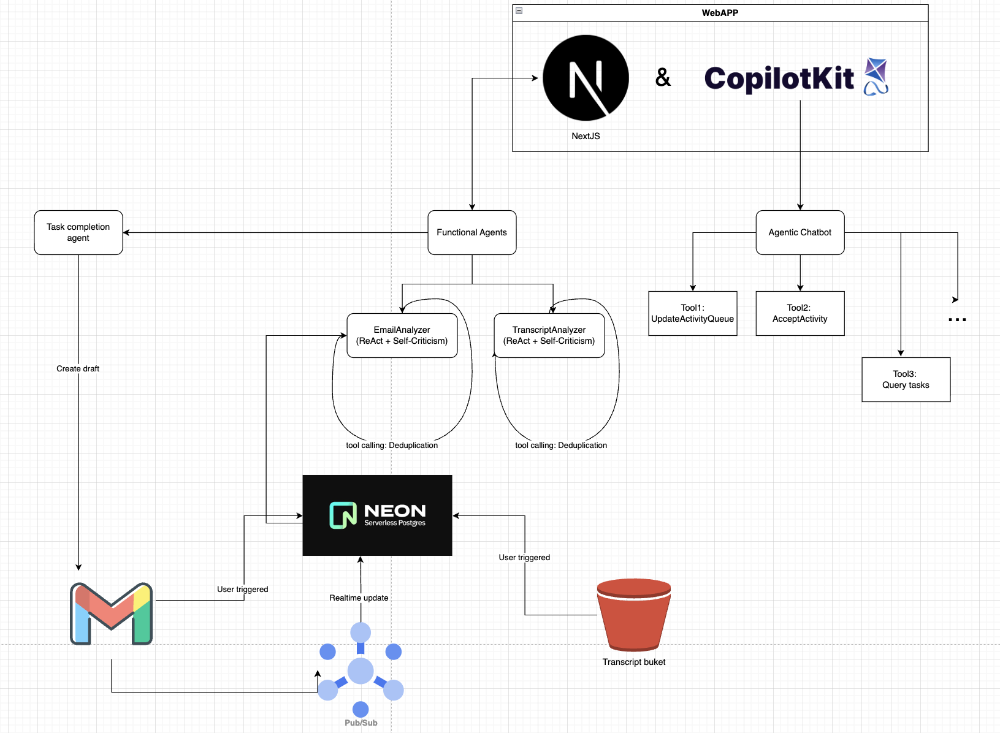

# Simplaix CRM - AI-Powered Customer Relationship Management

An intelligent CRM system built with Next.js, CopilotKit and Vercel AI SDK that automates contact management, deal tracking, and task workflows through AI-powered agents.

## Overview

Simplaix CRM combines modern web technologies with AI agents to provide:
- **Intelligent Contact Management** - Automatically extract and manage contacts, companies, and deals
- **Email Integration** - Sync with Gmail to automatically process emails and create tasks
- **AI Task Automation** - AI agents that help draft emails, manage tasks, and track activities
- **Real-time Collaboration** - Human-in-the-loop workflows for reviewing AI-suggested changes
- **Activity Tracking** - Monitor interactions, meetings, and sentiment across your pipeline

## Tech Stack


### Frontend
- **Next.js 15** (React 19) - App router with server components
- **CopilotKit** - AI copilot sidebar and state management
- **Tailwind CSS** - Utility-first styling
- **Radix UI** - Accessible component primitives
- **Drizzle ORM** - Type-safe database client
- **SWR** - Data fetching and caching
- **Zustand** - Client state management

### Backend
- **PostgreSQL** (Neon) - Serverless Postgres database
- **Google APIs** - Gmail integration and OAuth
- **Google Cloud Service Account** - For Pub/Sub
- **Vercel AI SDK** - For AI model inference

### AI & ML
- **Anthropic Claude** - Primary AI model for agents
- **AG-UI** - Agent-UI integration framework

## Prerequisites

Before you begin, ensure you have:

- **Node.js 20+** installed
- **pnpm** (recommended), npm, yarn, or bun
- **PostgreSQL database** - Neon serverless recommended
- **API Keys**:
  - Anthropic API key & OpenAI API key
  - Google Cloud Platform credentials (for Gmail integration)
  - Neon database connection string

## Getting Started

### 1. Clone and Install Dependencies

```bash
# Clone the repository
git clone https://github.com/hack-nation/simplaix-crm.git
cd hack-nation-simplaix-crm

# Install Node.js dependencies (this also sets up Python environment)
pnpm install

```

### 2. Database Setup

Create a Neon PostgreSQL database at [neon.tech](https://neon.tech) and note your connection string.

```bash
# Generate database migrations
pnpm run db:generate

# Apply migrations to your database
pnpm run db:migrate

# (Optional) Seed with sample contacts
pnpm run db:seed

# (Optional) Open Drizzle Studio to view/edit data
pnpm run db:studio
```

### 3. Environment Configuration

#### Frontend Environment (`.env.development.local`)

Create `.env.development.local` in the project root:

```env
# Database (setup with Vercel Postgres from Neon)
STORAGE_DATABASE_URL=postgresql://...
STORAGE_POSTGRES_URL=postgresql://...

# AI Models
ANTHROPIC_API_KEY=sk-ant-...
OPENAI_API_KEY=sk-...your-openai-key...

# Google OAuth & Gmail Integration
GOOGLE_CLIENT_ID=...apps.googleusercontent.com
GOOGLE_CLIENT_SECRET=...
GOOGLE_REDIRECT_URI=http://localhost:3000/api/auth/google/callback
GOOGLE_PROJECT_ID=your-project-id

# Google Cloud Service Account (for Pub/Sub)
GCP_CLIENT_EMAIL=...@...iam.gserviceaccount.com


```

#### Agent Environment (`agent/.env`)

Create `agent/.env` in the agent directory:

```env
OPENAI_API_KEY=sk-...your-openai-key...
```

> **Note:** The PydanticAI agent uses OpenAI by default. You can modify `agent/src/agent.py` to use Anthropic or other providers.

### 4. Start Development Servers

```bash
# Start both UI (port 3000) and agent (port 8000)
pnpm dev

# Or start individually:
pnpm run dev:ui      # Next.js only
pnpm run dev:agent   # Python agent only

# With debug logging:
pnpm run dev:debug
```

Visit [http://localhost:3000](http://localhost:3000) to access the application.

## Project Structure

```
hack-nation-simplaix-crm/
├── src/                      # Next.js application
│   ├── app/                  # App router pages & API routes
│   │   ├── (pages)/         # Page routes (people, tasks, etc.)
│   │   ├── api/             # API endpoints
│   │   │   ├── copilotkit/  # CopilotKit runtime
│   │   │   ├── gmail/       # Gmail integration
│   │   │   └── tasks/       # Task management
│   │   └── page.tsx         # Root page (redirects to /people)
│   ├── components/          # React components
│   ├── db/                  # Database schema & queries
│   │   ├── schema.ts        # Drizzle schema definitions
│   │   └── queries.ts       # Database queries
│   ├── lib/                 # Utilities & types
│   └── stores/              # Zustand state stores
├── scripts/                  # Build & utility scripts
├── drizzle/                  # Database migrations
├── public/                   # Static assets
└── .env.development.local    # Environment variables
```

## Available Scripts

### Development
```bash
pnpm dev              # Start both UI and agent servers
pnpm run dev:ui       # Start Next.js only (port 3000)
pnpm run dev:agent    # Start PydanticAI agent only (port 8000)
pnpm run dev:debug    # Start with debug logging
```

### Database
```bash
pnpm run db:generate  # Generate migrations from schema changes
pnpm run db:migrate   # Apply migrations to database
pnpm run db:push      # Push schema directly (dev only)
pnpm run db:studio    # Open Drizzle Studio GUI
pnpm run db:seed      # Seed database with sample data
```

### Build & Production
```bash
pnpm build            # Build Next.js for production
pnpm start            # Start production server
pnpm lint             # Run ESLint
```

### Testing
```bash
pnpm run test:gmail-webhook    # Test Gmail webhook endpoint
pnpm run test:create-task      # Test task creation
```

### Agent Management
```bash
cd agent
uv sync               # Sync Python dependencies
uv run src/main.py    # Run agent directly
```

## Core Features

### 1. Contact & Company Management
- Automatic contact extraction from emails
- Company association and deduplication
- Activity timeline tracking

### 2. Deal Pipeline
Track deals through stages:
- New
- In Discussion
- Proposal
- Won/Lost

### 3. Task Management
- AI-powered task creation from emails
- Priority levels (Low, Medium, High, Urgent)
- Task results with email drafting
- Tag-based organization

### 4. Email Integration
- Gmail OAuth authentication
- Automatic email sync and processing
- Activity extraction from email threads
- Smart email drafting for task responses

### 5. AI Agent Features
- Email response generation
- Natural language task creation
- Automatic contact/company extraction
- Sentiment analysis on interactions
- Meeting transcription processing

### 6. Human-in-the-Loop Workflows
- Review AI-suggested changes before applying
- Approve/reject activity proposals
- Auto-approve mode for trusted operations

## Architecture

### Frontend-Agent Communication

```
┌─────────────┐         ┌──────────────────┐         ┌─────────────┐
│  Next.js UI │  HTTP   │  CopilotKit API  │  HTTP   │Vercel AI SDK│
│  (Port 3000)│ ──────> │  /api/copilotkit │ ──────> │   Agent     │
│             │         │                  │         │             │
└─────────────┘         └──────────────────┘         └─────────────┘
       │                                                     │
       │                                                     │
       v                                                     v
┌─────────────┐                                      ┌─────────────┐
│  PostgreSQL │                                      │  OpenAI/    │
│  (Neon DB)  │                                      │  Anthropic  │
└─────────────┘                                      └─────────────┘
```

### State Management
- **Frontend**: Zustand stores for UI state, SWR for server data
- **Agent**: PydanticAI state models synced via CopilotKit
- **Database**: Drizzle ORM with PostgreSQL for persistence

## Environment Variables Reference

### Required Variables

| Variable | Description | Where to Get |
|----------|-------------|--------------|
| `STORAGE_DATABASE_URL` | PostgreSQL connection string | [Neon Console](https://neon.tech) |
| `ANTHROPIC_API_KEY` | Anthropic Claude API key | [Anthropic Console](https://console.anthropic.com) |
| `GOOGLE_CLIENT_ID` | Google OAuth client ID | [Google Cloud Console](https://console.cloud.google.com) |
| `GOOGLE_CLIENT_SECRET` | Google OAuth secret | Google Cloud Console |
| `GOOGLE_REDIRECT_URI` | OAuth callback URL | Set to `http://localhost:3000/api/auth/google/callback` |

### Optional Variables

| Variable | Description | Default |
|----------|-------------|---------|
| `OPENAI_API_KEY` | OpenAI API key (for agent) | Required if using OpenAI model |
| `BIGQUERY_DATASET_ID` | BigQuery dataset for analytics | None |
| `LOG_LEVEL` | Logging verbosity | `info` |

## Gmail Integration Setup

1. **Create Google Cloud Project**
   - Go to [Google Cloud Console](https://console.cloud.google.com)
   - Create a new project or select existing one

2. **Enable APIs**
   - Enable Gmail API
   - Enable Google Pub/Sub API (for real-time email notifications)

3. **Configure OAuth Consent Screen**
   - Set up OAuth consent screen
   - Add scopes: `gmail.readonly`, `gmail.send`
   - Add test users if in development

4. **Create OAuth Credentials**
   - Create OAuth 2.0 Client ID
   - Set authorized redirect URI to `http://localhost:3000/api/auth/google/callback`
   - Note client ID and secret

5. **Set Up Service Account** (for Pub/Sub)
   - Create service account
   - Grant Pub/Sub Admin role
   - Download JSON key file
   - Extract `client_email` for `GCP_CLIENT_EMAIL`

## Troubleshooting

### Database Migration Errors
```bash
# Reset database (WARNING: deletes all data)
pnpm run db:push

# Or manually apply migrations
cd drizzle
psql $DATABASE_URL -f <migration-file>
```

### Gmail Sync Not Working
- Verify OAuth credentials are correct
- Check that Gmail API is enabled in Google Cloud
- Ensure redirect URI matches exactly
- Check user settings table for token expiration

### Build Failures
```bash
# Clear Next.js cache
rm -rf .next
pnpm build

# Check for TypeScript errors
pnpm run lint
```

## Development Workflow

1. **Start development servers**: `pnpm dev`
2. **Make changes** to frontend in `src/` or agent in `agent/src/`
3. **Test changes** - both servers auto-reload
4. **Update database schema** in `src/db/schema.ts`
   - Run `pnpm run db:generate` to create migration
   - Run `pnpm run db:migrate` to apply
5. **Commit changes** following conventional commits
6. **Deploy** to Vercel (frontend) and your Python hosting service (agent)

## Contributing

We welcome contributions! Please:

1. Read `AGENTS.md` for repository guidelines
2. Follow the established code style (2-space indentation, PascalCase for components)
3. Write tests for new features
4. Run `pnpm lint` before committing
5. Include clear commit messages

## Resources

- [CopilotKit Documentation](https://docs.copilotkit.ai)
- [PydanticAI Documentation](https://ai.pydantic.dev)
- [Next.js Documentation](https://nextjs.org/docs)
- [Drizzle ORM Documentation](https://orm.drizzle.team)
- [Neon Documentation](https://neon.tech/docs)

## Support

For issues, questions, or feature requests:
- Open an issue on GitHub
- Check existing documentation in `CLAUDE.md` and `AGENTS.md`
- Review troubleshooting section above

